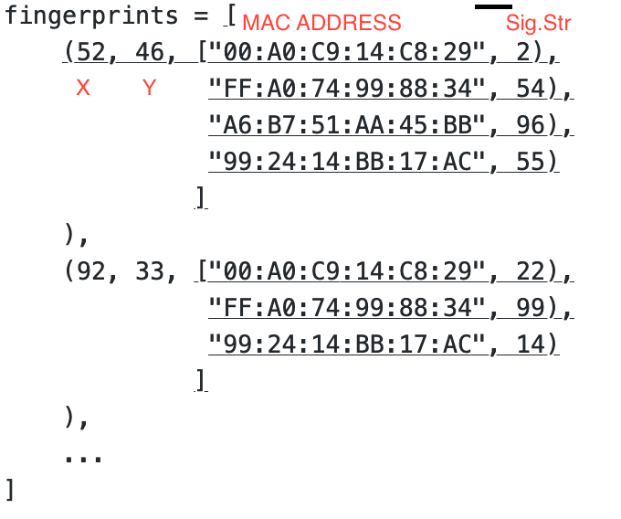

# IndoorPos_Recycling
Indoor Positioning and Recycling
Hi folks! as you can imagine we are not allowed to move much.

I have found an interesting library for map depiction

it is this one https://github.com/kivy-garden/garden.mapview

i tried it and it works like a charm and you can even load your own map.

You can save the MAC address with the signals whenever you want. But it will be best to do it when the school is active (meaining during the day) this way you can get an accurate measurement for when people are walking around (which will slightly affect the readings).

About the coronavirus: Have your report ready regardless, don't bank on any delays.

As a test could you please write in your readme file that you are seeing these?

23/3/2020: No worries so now i have a channel to talk to all of you from here (or at least some of you.) Whoevers sees this can you send an email to the others so they are aware of the conversation? Awesome thanks!
  For the Mac Address and signal strength to coordinates it is very simple: In python you can store lists of tuples so you can have a list called fingerprints that has the coordinates X and Y, then a list of tuples that include MAC addresses and the signal strength for each address. This would look like below:
 
 
 
(The red colored text is just comments to help you understand what is going on)
This is what the structure looks like try making it and insert fake numbers like the ones i have shown above to see if it works in theory.

  On another note I will try take a look probably some time this week at mapview and fix it for you folks, but i have been busy with adapting my flat to WFH and also a paper deadline!

26/3: continue sending questions if you have any!

1/4: Do you folks have any new code to upload?
2/4: we can run the demo on a laptop that isnt a big deal.
8/4: whichever one you guys want! (for the scanner) its your project. Also do we have a draft of the report?

9/4: awesome on the report. Will check the GUI over the weekend. also forgot to say that you dont need to know how many access points each coordinate will store. Just read them all and the append them to the structure i showed you. So if for instance you read 4 or 50 it wont make a difference. When trying to find the location, the program should iterate through all of the stored coordinates and then see how many MAC IDs are the same and then compare their signal strength. those that don't exist in either case can be put down as 0 when doing the comparison. Hope this helps!!

9/4b: No you will assign signal strengths to all coordinates, its just that it should be flexible in terms of how many each coordinate will have. If there are places with no signal then we can use them to map the area.
